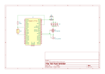

Verifying time delays
#####################

Syntalos does an excellent job at keeping devices synchronized and at keeping times,
but verifying that is better than just believing it!
Verifying time synchronization is also also a good regression test to ensure no code or
environment change has altered Syntalos' behavior, and a good test to find any inherent
latencies in the system that can be corrected as fixed errors in postprocessing.

Since buying a commercial pulse generator can be expensive, we've created a small
`Raspberry Pi Pico <https://www.raspberrypi.com/products/raspberry-pi-pico/>`_-based device
that can be built cheaply and used as test pulse generator.

Pi Pico Pulse Generator Hardware
================================

You will need to acquire the following parts:

=================  =====================  =====
Part               Example                URL
=================  =====================  =====
Raspberry Pi Pico  -                      `Raspberry Pi Pico <https://www.raspberrypi.com/products/raspberry-pi-pico/>`_
LEDs               Kingbright LED Array   `Mouser <https://www.mouser.de/ProductDetail/Kingbright/DE4SGD?qs=sGAEpiMZZMsdbfY7qIGLUvw%2FdtA4j7R5F%252BhvryFj4Zw%3D>`_
N-Ch Mosfet        STP16NF06              `Mouser STP16NF06 <https://www.mouser.de/ProductDetail/STMicroelectronics/STP16NF06?qs=FOlmdCx%252BAA3QgI0ylnH1gA%3D%3D>`_
Flip Switch        any                    -
=================  =====================  =====

You can fairly easily assemble these components like this:

It is recommended to put the LED on a wire, or even better, a BNC connector, so it can be moved away from the signal generator.
The wire will also allow for splitting the electrical signal to feed into other devices.

This is how the final result may look like, in a box:

.. figure:: /graphics/signalgen-outside.avif
  :width: 480
  :alt: Signal Generator: Outside

  Outside view of the signal generator box

.. figure:: /graphics/signalgen-inside.avif
  :width: 480
  :alt: Signal Generator: Inside

  Inside view of the signal generator box, no custom PCB required, only soldering

Pi Pico Pulse Generator Firmware
================================

You can now download the prebuilt firmware for the Pico pulse generator and upload it to the device,
or build it yourself.
To build it yourself, clone the Syntalos source code and use ``cmake`` for building the files
from ``contrib/testpulse-generator``:

.. code-block:: bash

    git clone --depth 1 https://github.com/bothlab/syntalos.git
    cd syntalos/contrib/testpulse-generator
    mkdir build && cd build
    cmake -DPICO_SDK_FETCH_FROM_GIT=ON ..
    make

This will generate a ``syntalos-testpulse-generator.uf2`` file in ``contrib/testpulse-generator/build``, which you
can then upload to your Pico to make it generate precise(ish) pulses as external control clock.

The switch on the device can be used to select one of two modes, depending on which position it is in when the device is powered on.
It can either operate in fixed-interval pulses, or vary the pulse interval.

Syntalos Measurement
====================

`TODO`
Coming soon!
