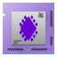

Intan RHX
#########

This module can interface with all `Intan Technologies <https://intantech.com/>`_ electrophysiology
amplifiers, including the RHD and RHS systems.

It wraps the Intan RHX software module directly, and therefore provides a familiar interface to users.

Usage
=====

The module uses its "Display" function to display the familiar Intan user interface, including live recording
of electrophysiology signals.

By default, the module has no output ports. By selecting its "Settings" panel, select ports can be marked
to be exported and can subsequently be connected to other modules.
By default, no ports are exported to improve performance.

.. image:: /graphics/intan-rhx-port-settings.avif
  :width: 400
  :alt: Export select channels as ports for Intan RHX

Ports
=====

.. list-table::
   :widths: 14 10 22 54
   :header-rows: 1

   * - Name
     - Direction
     - Data Type
     - Description

   * - [Channel]🠺
     - Out
     - ``FloatSignalBlock``
     - Exported values of user-defined, select channels.
   * - [Channel]🠺
     - Out
     - ``IntSignalBlock``
     - Exported values of user-defined, select channels.

Stream Metadata
===============

.. list-table::
   :widths: 15 85
   :header-rows: 1

   * - Name
     - Metadata

   * - [Channel]🠺
     - | ``sample_rate``: Double, Sampling rate in samples per second.
       | ``time_unit``: String, Unit of the data block timestamps. Always set to "index".
       | ``data_unit``: String, Unit of the signal block values. Usually "µV".
       | ``signal_names``: List<String>, List of signal names contained in each data block
