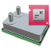

Pico Pi SP210 Pressure Sensor
#############################

This module can connects with a Raspberry Pi Pico running dedicated firmware to
drive a Superior Sensors `SP210 spirometry pressure sensor <https://superiorsensors.com/pressure-sensors/spirometry/>`_.

Pico firmware is provided. The Syntalos module will export the sensor's pressure and temperature
readings and allow a range of configuration options.

Usage
=====

This module needs a Raspberry Pi Pico connected to the pressure sensor via I2C as well as the respective firmware
flashed to the Pico chip. (TODO: Add instructions for assembly)

Once added to a Syntalos project, the module will acquire data with the selected sampling rate and zeroing
settings. Data can be recorded e.g. using a *JSON Writer* module, or displayed via a *Plot Time Series* module.

Ports
=====

.. list-table::
   :widths: 14 10 22 54
   :header-rows: 1

   * - Name
     - Direction
     - Data Type
     - Description

   * - Pressure Data🠺
     - Out
     - ``FloatSignalBlock``
     - Received pressure values, in mPa.
   * - Temperature Data🠺
     - Out
     - ``FloatSignalBlock``
     - Reported temperature, in °C.

Stream Metadata
===============

.. list-table::
   :widths: 15 85
   :header-rows: 1

   * - Name
     - Metadata

   * - [Channel]🠺
     - | ``time_unit``: String, Unit of the data block timestamps.
       | ``data_unit``: String, Unit of the signal block values.
       | ``signal_names``: List<String>, List of signal names contained in each data block
